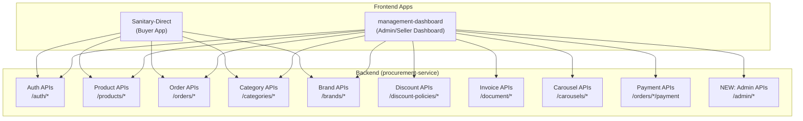

# B2B Management Dashboard — Implementation Plan

## Background

**Sanitary-Direct** is the buyer-facing React frontend for a B2B sanitary/plumbing procurement platform. **procurement-service** is the Spring Boot + MongoDB monolith backend that manages auth, products, orders, invoices, payments, brands, categories, discount policies, carousels, and procurement templates.

The goal is to build **management-dashboard** — a separate React application for **Admin** and **Seller** roles to manage the platform. The current buyer-facing app (`Sanitary-Direct`) is not designed for management operations.

**Tech Stack (Dashboard):** React 18 + Vite + TypeScript + **Ant Design 5** (UI library) + **Chart.js** (via `react-chartjs-2` for analytics)

---

## User Review Required

> [!IMPORTANT]
> **Missing Backend APIs**: The current backend has NO admin-specific endpoints for user management, seller approval, or analytics/aggregation. The dashboard will need ~12 new backend endpoints. These are detailed in [Phase 7 — Backend Gaps](#phase-7--new-backend-endpoints-required).

> [!WARNING]
> **Role System Gap**: The current backend stores `role` as a plain string on `UserEntity` (`buyer`, `seller`, `admin`). There is no UI or API to **change a user's role**. Signup hardcodes `role = "buyer"`. We need a new `PATCH /admin/users/{userId}/role` endpoint. Additionally, there is no concept of **seller approval** — any user promoted to seller can immediately create products.

> [!CAUTION]
> **No Seller Scoping on Products**: The current `ProductEntity` has a `sellerId` field but the `ProductController` does NOT filter products by `sellerId`. A seller can currently see/edit **all** products. We need to add seller-scoped product queries, or the seller dashboard will expose data from other sellers.

---

## Finalized Decisions

| # | Question | Decision |
|---|----------|----------|
| Q1 | Multi-Seller Orders | Seller dashboard shows **only their own line items** + their portion of the order total |
| Q2 | Seller Onboarding | Admin **directly flips** any user's role via dashboard — no formal application workflow |
| Q3 | Login & Routing | **Unified login** page — auto-routes to Admin or Seller dashboard based on JWT role claim. Buyers get an "Access Denied" screen |
| Q4 | Product Ownership | When admin creates a product, admin **selects a seller from a dropdown** to assign as `sellerId` |
| Q5 | Backend Architecture | **Same `procurement-service`** — new endpoints added alongside existing ones, secured via JWT roles |
| Q6 | Build Strategy | **Backend + Frontend together** — build backend endpoint first, then the frontend page consuming it |
| Q7 | Execution Priority | **MVP first** — Login → Dashboard Analytics → Product Management → Order Management, then expand |

---

## Architecture Overview

---

## Role Capabilities Matrix

| Feature | Admin | Seller |
|---------|:-----:|:------:|
| **Dashboard Analytics** (revenue, orders, users) | ✅ All data | ✅ Own data only |
| **User Management** (list, view, change roles) | ✅ | ❌ |
| **Seller Approval/Management** | ✅ | ❌ |
| **Product Management** (CRUD, bulk upload) | ✅ All products | ✅ Own products only |
| **Order Management** (view, status transitions) | ✅ All orders | ✅ Own orders only |
| **Category Management** (CRUD, hierarchy) | ✅ | ❌ |
| **Brand Management** (CRUD, enable/disable) | ✅ | ✅ Own brands |
| **Discount Policy Management** | ✅ | ✅ |
| **Invoice Generation & Download** | ✅ | ✅ Own invoices |
| **Payment Verification** | ✅ | ❌ |
| **Carousel/Banner Management** | ✅ | ❌ |
| **Homepage Config Management** | ✅ | ❌ |
| **Filter Attribute Management** | ✅ | ❌ |
| **Seller Profile / Business Settings** | ❌ | ✅ |

---

## Proposed Changes

### Phase 1 — Project Scaffolding & Foundation

#### [NEW] management-dashboard project

Scaffold a new Vite + React + TypeScript project in `/Users/apple/development/b2b-startup/management-dashboard/`.

- Initialize with `npx -y create-vite@latest ./ --template react-ts`
- Install dependencies: `antd`, `@ant-design/icons`, `chart.js`, `react-chartjs-2`, `axios`, `react-router-dom`
- Configure Vite proxy to `procurement-service` (same pattern as `Sanitary-Direct`)
- Set up Ant Design's `ConfigProvider` with custom theme tokens (dark professional palette)

#### [NEW] src/config/theme.ts
Ant Design 5 theme configuration — custom color tokens, border radius, font family.

#### [NEW] src/services/api.ts
Axios instance with JWT interceptor (reuse pattern from `Sanitary-Direct`'s [api.ts](file:///Users/apple/development/b2b-startup/Sanitary-Direct/src/services/api.ts)).

#### [NEW] src/services/authService.ts
Auth API calls: login, refresh, logout — wrapping `/auth/initiate`, `/auth/authenticate`, `/auth/refresh-token`, `/auth/logout`.

#### [NEW] src/context/AuthContext.tsx
Auth context with JWT parsing for role extraction (`role` claim from JWT), route guards.

---

### Phase 2 — Layout & Routing

#### [NEW] src/layouts/DashboardLayout.tsx
Ant Design `Layout` with:
- **Sider**: collapsible sidebar with role-aware menu items (using `Ant Menu`)
- **Header**: user info, role badge, notifications bell, logout
- **Content**: `<Outlet />` for nested routes
- **Footer**: copyright

#### [NEW] src/router/index.tsx
React Router v6 setup:
- `/login` — Login page
- `/dashboard` — Analytics home (role-aware)
- `/products` — Product list
- `/products/new` — Create product
- `/products/:id` — Edit product
- `/orders` — Order list
- `/orders/:id` — Order detail
- `/categories` — Category management (admin only)
- `/brands` — Brand management
- `/discount-policies` — Discount policy management
- `/users` — User management (admin only)
- `/carousels` — Carousel management (admin only)
- `/invoices/:orderId` — Invoice viewer
- `/settings` — Seller business settings
- `/payments` — Payment verification (admin only)

#### [NEW] src/components/guards/RoleGuard.tsx
Route guard component that checks JWT role claim and redirects if unauthorized.

---

### Phase 3 — Authentication Pages

#### [NEW] src/pages/Login.tsx
Premium login page with:
- Ant Design `Form`, `Input`, `Button`
- Support for both credential and OTP auth (reads `/auth/config`)
- Animated gradient background, glass-morphic card
- Auto-redirect based on role after login

---

### Phase 4 — Product Management

#### [NEW] src/pages/products/ProductList.tsx
- Ant Design `Table` with server-side pagination (using existing `GET /products/all?page=&size=`)
- Columns: Image, Name, SKU, Brand, Category, Price, Stock, Status, Actions
- Filters: by brand, category, active/inactive
- **Seller view**: filtered to `sellerId` matching logged-in user
- **Admin view**: all products with seller column
- Actions: Edit, Delete, Toggle Active

#### [NEW] src/pages/products/ProductForm.tsx
- Ant Design `Form` with rich inputs for creating/editing products
- Image URL management
- Variant management (dynamic form for variant attributes)
- HSN, GST rate, discount policy assignment
- Category and brand selectors (cascading dropdowns)
- Bulk upload tab (Excel/CSV via `POST /products/uploadExcel` and `POST /products/uploadCsv`)

#### [NEW] src/services/productService.ts
API calls wrapping:
- `GET /products/all` — List (paginated)
- `GET /products/{productId}` — Detail
- `POST /products/createProduct` — Create
- `PUT /products/{productId}/attributes` — Update attributes
- `PUT /products/{productId}/discount-policy` — Assign discount
- `DELETE /products/{productId}` — Delete
- `POST /products/uploadExcel` — Bulk upload
- `POST /products/uploadCsv` — Bulk upload
- **NEW** `PUT /products/{productId}` — Full product update (currently missing!)
- **NEW** `GET /products/seller/{sellerId}` — Seller-scoped list (currently missing!)

---

### Phase 5 — Order Management

#### [NEW] src/pages/orders/OrderList.tsx
- Ant Design `Table` with columns: Order ID, Customer, Date, Status (Tag), Total, Items, Actions
- Status filter tabs: ALL, PENDING, CONFIRMED, SHIPPED, DELIVERED, CANCELLED
- **Admin view**: all orders across all users (needs new endpoint)
- **Seller view**: only orders containing seller's products (needs new endpoint)
- Clickable row → Order Detail

#### [NEW] src/pages/orders/OrderDetail.tsx
- Full order breakdown: items table, financial summary, shipping address
- Status timeline (using Ant `Steps` + `statusHistory`)
- Status transition buttons with confirmation modals
- Buyer/Seller snapshots display
- Invoice generation link → opens PDF viewer
- Payment status display
- Admin: dispatch details form (mode of payment, dispatch through, doc no)

#### [NEW] src/services/orderService.ts
API calls wrapping:
- `GET /orders` — User's orders (paginated)
- `GET /orders/{orderId}` — Detail
- `POST /orders/{orderId}/status` — Admin status update
- `PATCH /orders/{orderId}/status` — Status update
- **NEW** `GET /admin/orders` — All orders (admin, paginated, filterable)
- **NEW** `GET /seller/orders` — Seller's orders only

---

### Phase 6 — Catalog & Content Management (Admin-heavy)

#### [NEW] src/pages/categories/CategoryManager.tsx
- Tree view of categories using Ant `Tree` component
- CRUD: Create child/sibling, edit name/image/description, enable/disable
- Drag-and-drop reordering (future)
- Uses: `GET /categories/tree`, `POST /categories/create`, `PUT /categories/update`, `PUT /categories/enable`, `PUT /categories/disable`

#### [NEW] src/pages/brands/BrandManager.tsx
- Card/Table hybrid view of brands
- CRUD: Create, edit, enable/disable
- Logo and banner image management
- Uses: `GET /brands/all`, `POST /brands/create`, `PUT /brands/update`, `PUT /brands/enable`, `PUT /brands/disable`

#### [NEW] src/pages/discounts/DiscountPolicyManager.tsx
- Table of discount policies with expandable tier details
- CRUD: Create, edit tiers, toggle active
- Scope selector: CATEGORY / PRODUCT / NONE
- Uses: `GET /discount-policies`, `POST /discount-policies`, `PUT /discount-policies/{id}`, `DELETE /discount-policies/{id}`

#### [NEW] src/pages/carousels/CarouselManager.tsx
- Sortable list of carousel banners with preview
- Create new carousel with image upload, title, tagline, action items
- Uses: `GET /carousels/all`, `POST /carousels/create`
- **NEW** `PUT /carousels/{id}` — Update carousel (currently missing!)
- **NEW** `DELETE /carousels/{id}` — Delete carousel (currently missing!)

#### [NEW] src/pages/users/UserManager.tsx (Admin only)
- Ant Design `Table` of all registered users
- Columns: Name, Mobile, Company, GSTIN, Role (Tag), Phone Verified, Actions
- Actions: Change role (dropdown → buyer/seller/admin), view details
- Seller approval workflow
- **NEW** `GET /admin/users` — List all users
- **NEW** `PATCH /admin/users/{userId}/role` — Change role
- **NEW** `GET /admin/users/{userId}` — User detail

#### [NEW] src/pages/payments/PaymentVerification.tsx (Admin only)
- Table of pending Stage 10 payments
- Verify button → calls payment verification endpoint
- Auto-refreshing list
- **NEW** `GET /admin/payments/pending` — List pending payments

#### [NEW] src/pages/homepage/HomepageConfigManager.tsx (Admin only)
- Visual editor for homepage layout (explore cards, featured brands/products)
- Uses: `GET /details/home`, `POST /details/home/create`

---

### Phase 6.5 — Analytics Dashboard (Chart.js)

#### [NEW] src/pages/dashboard/AdminDashboard.tsx
Chart.js visualizations:
- **Revenue Chart** (Line/Bar): Monthly revenue over time
- **Orders by Status** (Doughnut): PENDING / CONFIRMED / SHIPPED / DELIVERED / CANCELLED
- **Top Selling Products** (Horizontal Bar)
- **New Users** (Line): Registration trend
- **KPI Cards**: Total Revenue, Total Orders, Active Products, Active Sellers, Pending Payments
- All data from **NEW** `GET /admin/analytics/summary` endpoint

#### [NEW] src/pages/dashboard/SellerDashboard.tsx
Chart.js visualizations:
- **My Revenue** (Line): Seller's revenue over time
- **My Orders by Status** (Doughnut)
- **My Top Products** (Bar)
- **KPI Cards**: My Revenue, My Orders, My Products, My Pending Payments
- All data from **NEW** `GET /seller/analytics/summary` endpoint

#### [NEW] src/components/charts/RevenueChart.tsx
Reusable Chart.js Line chart component.

#### [NEW] src/components/charts/OrderStatusChart.tsx
Reusable Chart.js Doughnut chart component.

#### [NEW] src/components/charts/TopProductsChart.tsx
Reusable Chart.js Horizontal Bar chart component.

#### [NEW] src/components/charts/KPICards.tsx
Grid of Ant Design `Statistic` cards with animated counters.

---

### Phase 7 — New Backend Endpoints Required

These endpoints **do not exist** in the current `procurement-service` and must be built:

| Endpoint | Method | Purpose | Required By |
|----------|--------|---------|-------------|
| `/admin/users` | GET | List all users (paginated, filterable by role) | User Management |
| `/admin/users/{userId}` | GET | Get user detail | User Management |
| `/admin/users/{userId}/role` | PATCH | Change user role | User Management |
| `/admin/orders` | GET | List ALL orders (paginated, filterable) | Admin Order Management |
| `/seller/orders` | GET | List orders containing seller's products | Seller Order Management |
| `/admin/analytics/summary` | GET | Platform-wide analytics aggregation | Admin Dashboard |
| `/seller/analytics/summary` | GET | Seller-scoped analytics aggregation | Seller Dashboard |
| `/admin/payments/pending` | GET | List pending payment verifications | Payment Verification |
| `/products/{productId}` | PUT | Full product update (not just attributes) | Product Edit |
| `/products/seller/{sellerId}` | GET | Products by seller (paginated) | Seller Product List |
| `/carousels/{id}` | PUT | Update carousel | Carousel Management |
| `/carousels/{id}` | DELETE | Delete carousel | Carousel Management |

#### [MODIFY] [SecurityConfig.java](file:///Users/apple/development/b2b-startup/procurement-service/src/main/java/com/marketplace/procurement/config/SecurityConfig.java)
Add authorization rules for new `/admin/**` and `/seller/**` paths:
- `/admin/**` → `hasRole("ADMIN")`
- `/seller/**` → `hasAnyRole("ADMIN", "SELLER")`

#### [NEW] AdminController.java
New controller for user management and analytics.

#### [NEW] SellerController.java
New controller for seller-scoped operations.

#### [NEW] AdminService.java / AnalyticsService.java
Business logic for aggregations (MongoDB aggregation pipelines for revenue, order counts, etc.)

---

## Verification Plan

### Automated Tests
1. `npm run lint` — TypeScript type checking
2. `npm run build` — Verify production build succeeds
3. Manual browser testing of each page with admin and seller JWT tokens

### Manual Verification
- Login as admin → verify all menu items visible, analytics populated
- Login as seller → verify restricted menu, only own data visible
- Create/Edit/Delete a product via dashboard → verify it appears in buyer app
- Update order status → verify status history records correctly
- Verify payment → confirm order transitions
- Test responsive layout on tablet/desktop breakpoints

---

## Execution Order — MVP First

### 🚀 MVP (Build First)
| Phase | Scope | Depends On |
|-------|-------|------------|
| **1** | Project scaffold, theme, API layer, auth context | Nothing |
| **2** | Layout, routing, role guards, access denied screen | Phase 1 |
| **3** | Login page (unified, auto-route by role) | Phase 2 |
| **4** | Dashboard Analytics + backend aggregation endpoints | Phase 3 |
| **5** | Product Management + backend seller-scoped endpoints | Phase 3 |
| **6** | Order Management + backend admin/seller order endpoints | Phase 3 |

### 📦 Post-MVP (Expand)
| Phase | Scope | Depends On |
|-------|-------|------------|
| **7** | User Management (admin role flipping) | Phase 3 |
| **8** | Category & Brand Management | Phase 3 |
| **9** | Discount Policy, Carousel, Homepage Config Management | Phase 3 |
| **10** | Payment Verification (admin) | Phase 6 |
| **11** | Seller Profile / Business Settings | Phase 3 |
